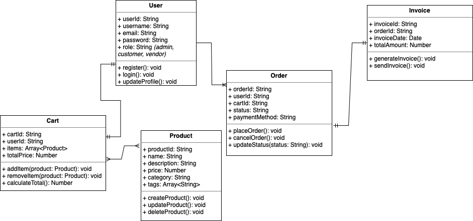

# E-commerce REST API using Node.js

This project involves building a RESTful API for an e-commerce application. The API provides core functionalities essential for managing users, shopping carts, products, orders, and payments. It also implements key security practices.

This project is made by Tien Quoc (Kelvin) Bui for Server Side JavaScript class hehe.

---

## User Management
- Registration & login (with authentication via JWT or Oauth)
- User roles management (admin, customer, vendor)
- User profile management

## Product Management
- Create, update, delete products
- Product categorization and tagging for filtering

## Cart & Checkout
- Add or remove items from the shopping cart
- Calculate total cost dynamically

## Order & Payment System
- Order placement and invoice generation

## API & Security
- RESTful API structure using Express.js
- Middleware for authentication and authorization
- Rate limiting to protect from abuse
- Input validation for enhanced security

## Technologies & Resources
- **Node.js**: Runtime environment for JavaScript execution
- **Express.js**: Framework for creating APIs
- **JWT/OAuth**: User authentication and security
- **Multer**: Handling file uploads
- **MongoDB**: NoSQL database, using Mongoose for schemas
- **dotenv**: Environment variable management
- **helmet & CORS**: Enhanced API security

## Testing & Debugging
- **Postman**: API endpoint testing
- **Jest or Mocha/Chai**: Unit testing for backend functionalities

---

## My UML Diagram
Note: Maybe you cannot see the relation when your computer is in dark mode.

